# Tài liệu hướng dẫn KICAD cơ bản cho New-bie Netwai.

Bài hướng dẫn này sẽ dẫn dắt bạn đi qua một dự án KiCad mẫu đơn giản, từ việc xây dựng sơ đồ nguyên lý (schematic) đến thiết kế mạch in (PCB layout). Trong dự án này, chúng ta sẽ được cung cấp một sơ đồ mẫu để làm theo và thiết kế lại từ đầu. Chúng ta cũng sẽ tìm hiểu về cách liên kết, chỉnh sửa và tạo thư viện linh kiện. Cuối cùng, chúng ta sẽ xuất các file gia công cần thiết để xưởng có thể sản xuất bo mạch.

Để bắt đầu, trước tiên chúng ta phải tải xuống và cài đặt KiCad. Truy cập vào [trang tải xuống của trang web KiCad](https://www.kicad.org/download/), chọn hệ điều hành của bạn và tải xuống phiên bản mới nhất.

>[!IMPORTANT]
Hướng dẫn này được viết dựa trên KiCad 8.0 trên Windows 10. (Vui lòng sử dụng phiên bản này để dễ dàng thực hành theo, hiện tại Kicad đã ra đến phiên bản 10.0, tuy nhiên bạn cũng có thể dùng phiên bản 9.0 để làm theo vì nó cũng không khác 8.0 lắm. Phiên bản cũ theo lý thuyết vẫn là phiên bản ổn định nhất nếu bạn không phải người FOMO).

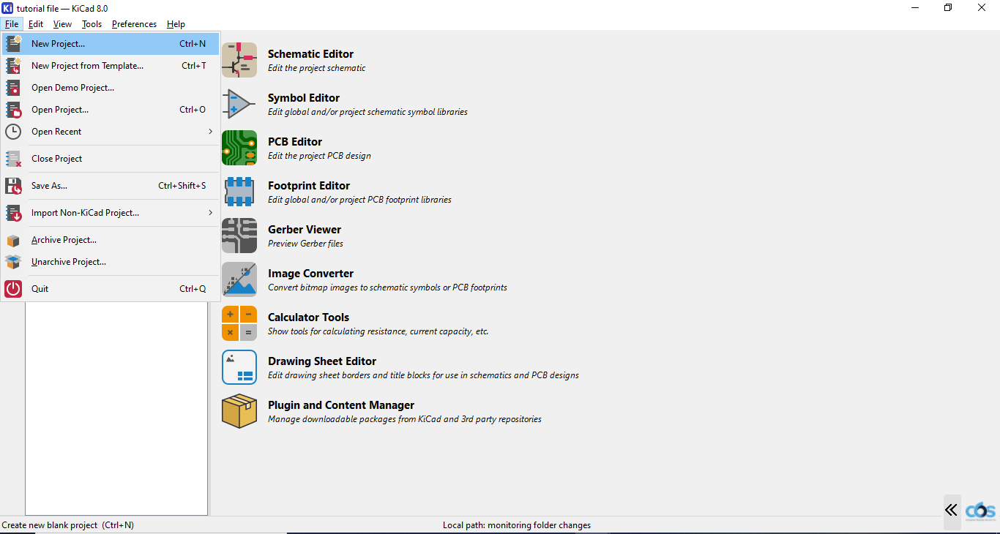
Sau khi cài đặt và mở KiCad, bạn có thể vào _File -> New Project,_ và đặt tên dự án tùy ý. Khi đã đặt tên xong, bạn chọn __Schematic Editor__ để bắt đầu.

## Tạo Sơ đồ nguyên lý (Schematic)
Khi mở ra, __Schematic Editor__ sẽ trông như thế này, một bản vẽ trống với khung viền màu đỏ và các hộp thông tin bản vẽ.

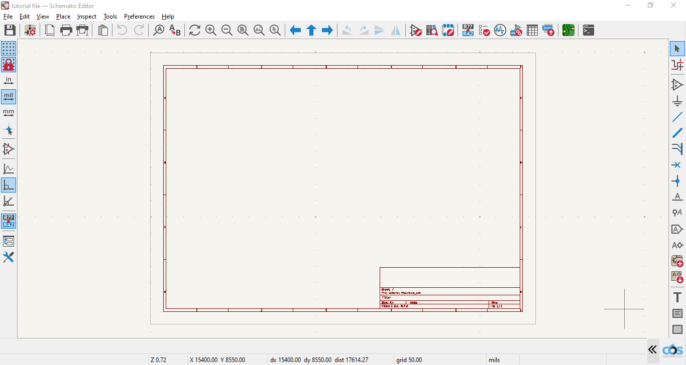

Mục tiêu của dự án này là vẽ lại mạch điện đơn giản dưới đây và chuẩn bị xuất file gia công. Ví dụ này chỉ có 6 linh kiện chính, làm cho công việc trở nên đơn giản hơn hầu hết các dự án thực tế, nhưng nó đủ để giúp bạn hiểu các bước cơ bản của KiCad và thiết kế PCB.

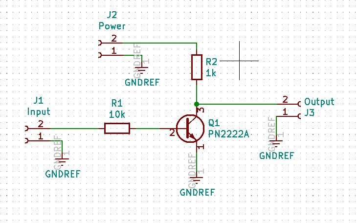

### Thêm Ký hiệu linh kiện (Symbols)

Để bắt đầu vẽ lại mạch này, trước tiên hãy lấy linh kiện ra. Bạn có thể sử dụng nút _Add Symbols_ trên thanh công cụ bên phải, hoặc nhấn phím _"A"_ trên bàn phím, sau đó click chuột trái vào bất kỳ đâu trên không gian làm việc để bắt đầu chọn linh kiện.

 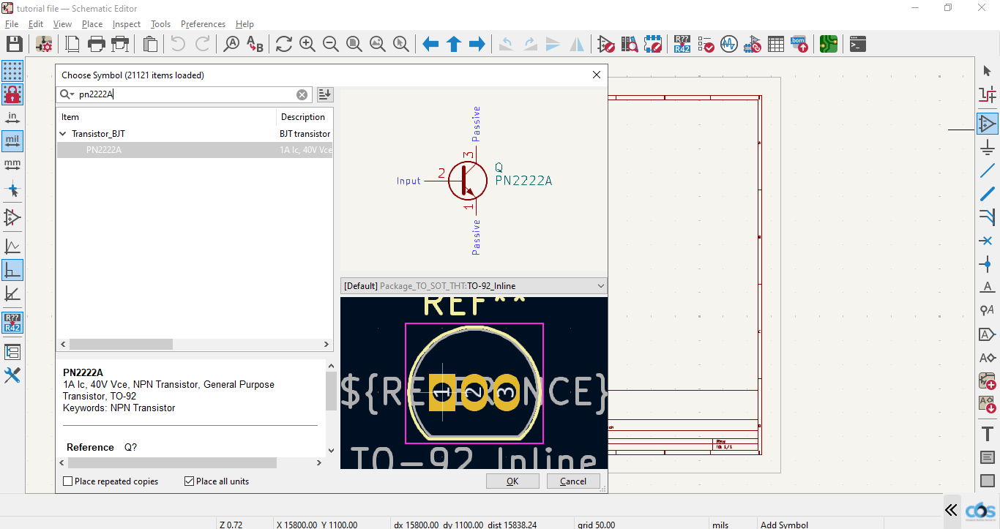

Một cửa sổ sẽ mở ra cho phép bạn nhập tên linh kiện muốn lấy. Hầu hết các linh kiện đều có tên đi kèm (trừ khi chúng được đổi tên, như trường hợp của các connector trong mạch ví dụ) hoặc sử dụng các ký hiệu điện tử tiêu chuẩn giúp chúng ta dễ nhận biết. Khi đã chọn được linh kiện, bạn có thể xoay nó bằng phím _"R"_ trên bàn phím, sau đó click chuột trái để đặt nó xuống vùng làm việc. Bạn cũng có thể dùng phím _"X"_ và _"Y"_ để lật linh kiện theo trục X hoặc Y. Sau khi đặt một linh kiện, bạn sẽ thấy mình vẫn đang ở chế độ đặt linh kiện. Nhấn phím _"esc"_ trên bàn phím để quay lại chế độ con trỏ chuột bình thường. Cách này áp dụng cho mọi thao tác trong KiCad, nên nếu bạn bị kẹt ở công cụ nào đó, cứ nhấn _"esc"_ để thoát.

>[!TIP]
Khi đặt bất kỳ Symbol nào, KiCad sẽ tự động đánh số thứ tự (annotate) dựa trên thứ tự bạn lấy ra. Việc đánh số này rất quan trọng để giữ sự ngăn nắp khi thiết kế và lắp ráp PCB. Bạn có thể thay đổi tên đánh số bằng cách click đúp vào chúng và nhập thủ công bất cứ lúc nào. Không có tiêu chuẩn bắt buộc nào về cách đánh số, nó tùy thuộc vào người thiết kế, nhưng hãy cố gắng áp dụng một hệ thống thống nhất để tránh gây nhầm lẫn cho bạn và những người xem bản vẽ sau này.

Mạch ví dụ này sử dụng một transistor, hai điện trở và ba connector cái 1x2. Hãy đặt tất cả các linh kiện ở vị trí trung tâm của bản vẽ, tương tự như ví dụ. Khi đã đặt xong tất cả, bạn đã sẵn sàng chuyển sang bước tiếp theo: thêm các điểm nối mass (Reference grounds).

### Thêm Ký hiệu Nguồn (Power Symbols)

Quá trình này tương tự như thêm linh kiện, tuy nhiên, thay vì chọn _"Add Symbols"_, bạn hãy chọn nút _"Add Power Symbols"_ ngay bên dưới nó, hoặc nhấn phím _"P"_ trên bàn phím.

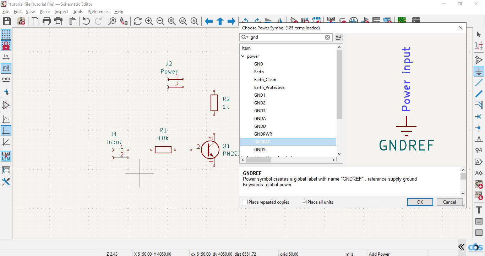

Một cửa sổ tương tự sẽ mở ra để bạn tìm kiếm các ký hiệu mass (GND). Cửa sổ này cho phép bạn chèn tất cả các loại GND, nguồn cấp, và nhiều ký hiệu liên quan đến nguồn khác. Sau khi bạn đặt một cái xuống, bạn không cần lặp lại quá trình này cho những cái còn lại. Bạn chỉ cần copy linh kiện bằng cách chọn nó và nhấn _"ctrl + c"_ hoặc trỏ chuột vào nó và nhấn _"C"_. Sau đó dán ra bằng _"ctrl + v"_.

### Đi dây Sơ đồ nguyên lý (Wiring)
Khi đã đặt xong bốn điểm mass, bạn đã sẵn sàng nối dây cho các linh kiện. Bắt đầu bằng cách nhấn nút _"Add a Wire"_ trên thanh công cụ bên phải, hoặc nhấn phím _"W"_. Sau đó, chỉ cần click chuột trái vào các chân kết nối của linh kiện, kéo dây tạo kết nối và làm theo sơ đồ mẫu.

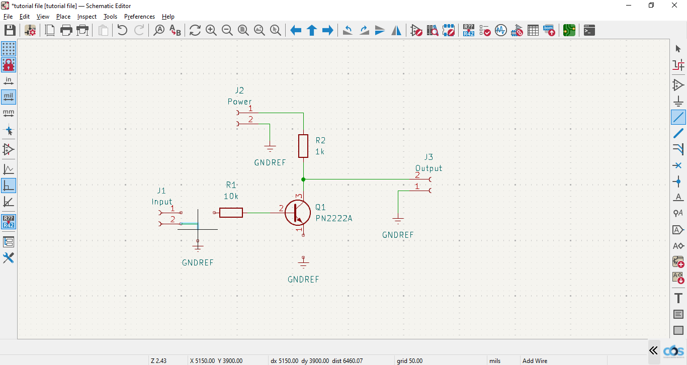

Khi nối dây xong, mạch của bạn đã có chức năng giống hệt mạch mẫu. Bây giờ chúng ta chỉ cần đổi tên các cổng đầu vào/đầu ra. Việc này không ảnh hưởng đến chức năng của mạch, nó chỉ là một thói quen tốt trong ngành để giúp những người xem bản vẽ dễ hiểu hơn. Như bạn có thể thấy ở hình trên, tôi đã đổi tên các connector. Để làm điều này, bạn chỉ cần click đúp vào tên của linh kiện, hoặc nhấn phím _"V"_ khi đang trỏ chuột vào nó. Một cửa sổ sẽ mở ra để bạn nhập tên tùy ý.

### Kiểm tra Lỗi Nguyên lý (Electrical Rules Check - ERC)
Chúc mừng! Nếu bạn làm đến bước này thì bạn đã tái tạo thành công mạch điện trong _Schematic Editor_. Bước tiếp theo là chạy công cụ _Electrical Rules Check_ hay _ERC_. Nút này nằm trên thanh công cụ phía trên góc phải. Công cụ này kiểm tra xem mạch bạn tạo ra có tuân thủ các quy tắc điện cơ bản hay không. Về cơ bản, nó giúp kiểm tra xem bạn có quên nối chỗ nào quan trọng không.

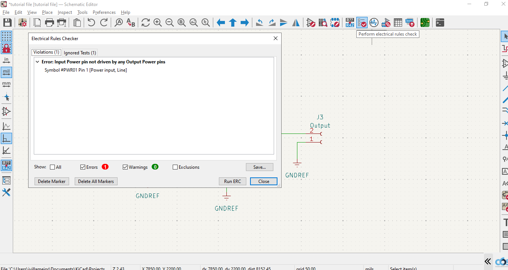

Khi chạy, ERC phát hiện một lỗi, như hình trên. Đây là một lỗi đơn giản: KiCad không thể phân biệt được connector nào là đầu vào cấp nguồn. Bạn (người thiết kế) biết đâu là nguồn vì bạn đã đặt tên connector đó là "POWER", nhưng KiCad thì không. Để khắc phục, chỉ cần đặt một cờ báo nguồn (Power Flag) trên đường dây nối giữa connector cấp nguồn và mass của nó. Power Flag có thể tìm thấy trong cửa sổ _"Add Power Symbols"_ (phím P), ngay kết quả đầu tiên khi bạn gõ "flag". Bạn sẽ biết mình làm đúng nếu khi chạy lại ERC, hệ thống báo không có lỗi nào.

### Gán Footprint (Dấu chân linh kiện)

Chúng ta gần xong với sơ đồ nguyên lý rồi, bây giờ phải gán Footprint 3D cho các Symbol của linh kiện. Bước này cho phép chúng ta chuyển sang thiết kế PCB. Footprint về cơ bản là cung cấp cho KiCad kích thước chính xác của linh kiện thực tế để bạn có thể sắp xếp chính xác vị trí của chúng trên bo mạch PCB.
Để bắt đầu chọn Footprint, nhấn nút _"Run Footprint Assignment Tool"_ trên thanh công cụ phía trên. Một cửa sổ sẽ mở ra: bên trái là tất cả các thư viện Footprint KiCad đã cài sẵn, ở giữa là các linh kiện trong sơ đồ của bạn, và bên phải là các Footprint phù hợp.

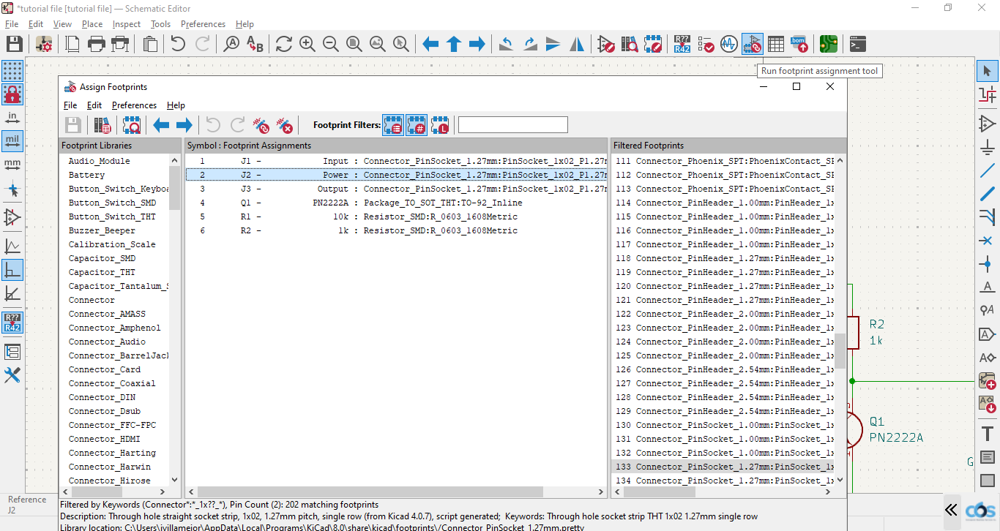

Như bạn thấy trong hình trên, tôi đã gán xong Footprint cho các Symbol. Một số linh kiện đã tự động được chọn sẵn Footprint; bạn không cần thay đổi trừ khi bạn muốn dùng một loại cụ thể khác. Footprint thường được cung cấp bởi các nhà sản xuất linh kiện thực tế. Đó là lý do tại sao có rất nhiều Footprint khác nhau cho mỗi schematic, vì các nhà sản xuất khác nhau làm ra các sản phẩm có kích thước hơi khác nhau. Khi chọn Footprint, bạn phải chắc chắn rằng linh kiện đó có sẵn để mua trên thị trường và đáp ứng được nhu cầu dự án. Các kỹ sư phần cứng giàu kinh nghiệm sẽ biết hãng nào cung cấp linh kiện tốt nhất để chọn Footprint phù hợp. Việc chọn Footprint phụ thuộc vào nhiều yếu tố và cần kinh nghiệm tích lũy. Tạm thời, bạn có thể chọn giống như tôi bằng cách gõ tên của chúng vào thanh tìm kiếm.

>[!TIP]
Bạn có thể click chuột phải vào bất kỳ Footprint nào và chọn "View selected footprint" để xem nó trông như thế nào. Bạn cũng có thể click vào nút "Show 3D Viewer" trên thanh công cụ phía trên, hoặc nhấn "Alt + 3" để xem bản render 3D của linh kiện đó.

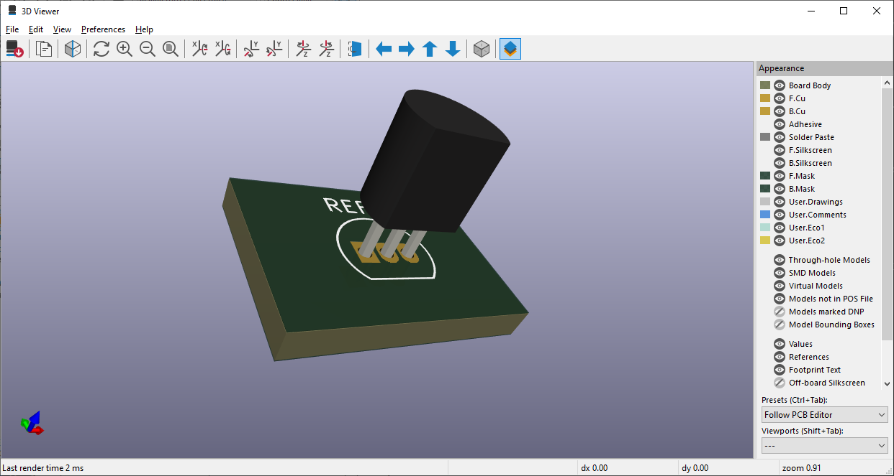

## Trình thiết kế Mạch in (PCB Editor)

Khi sơ đồ nguyên lý đã hoàn tất và Footprint đã được gán, chúng ta có thể chuyển sang vẽ bo mạch thực tế. Bạn có thể chuyển từ trình schematic sang PCB editor bằng cách nhấn nút _"Open PCB in Board Editor"_ trên thanh công cụ phía trên bên phải. Hoặc bạn có thể quay lại cửa sổ chính của KiCad và chọn _"PCB Editor"_. __Đừng quên lưu file sơ đồ nguyên lý trước nhé!__

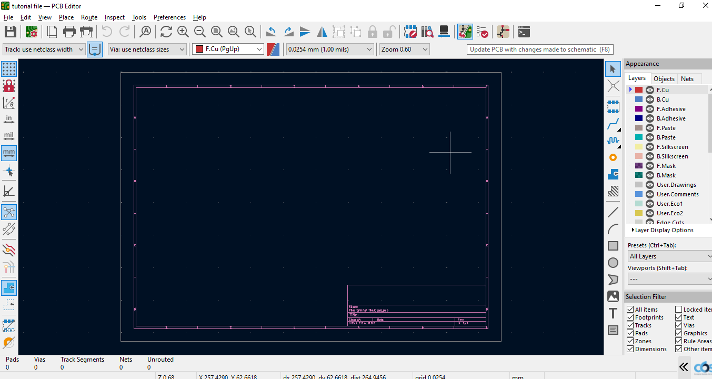

Khi mở PCB editor, bạn sẽ thấy một màn hình đen. Để import (nhập) các linh kiện từ sơ đồ nguyên lý chúng ta vừa vẽ, bạn nhấn nút _"Update PCB with changes made to the schematic"_ trên thanh công cụ phía trên bên phải, hoặc đơn giản là nhấn _"F8"_. Nút này sẽ tự động nhập linh kiện để bạn có thể đặt tất cả chúng ra bản vẽ cùng lúc. Nút này cũng tự động tạo một Netlist (danh sách kết nối mạng) - bước mà ở các phiên bản KiCad cũ hơn phải làm thủ công.

 >[!NOTE]
 Netlist chứa thông tin về các linh kiện, tên đánh số (designators), chân (pins) và tên của các đường mạng (nets) kết nối các chân với nhau. Nhà máy sản xuất có thể yêu cầu file này để phục vụ việc cắm/dán linh kiện (Assembly). Cách xuất file này, cùng với các file cần thiết khác để sản xuất PCB, sẽ được hướng dẫn ở cuối bài.

### Cài đặt PCB (PCB Setup)

Nút _"Update PCB with changes made to the schematic"_ có thể nhấn vào bất kỳ lúc nào trong quá trình thiết kế, nên đừng ngại quay lại sửa schematic nếu bạn phát hiện vấn đề. Vì lý do đó, trước khi xếp linh kiện, nên thiết lập các thông số PCB bằng cách nhấn nút _"Edit Board setup"_ ở thanh công cụ phía trên bên trái.

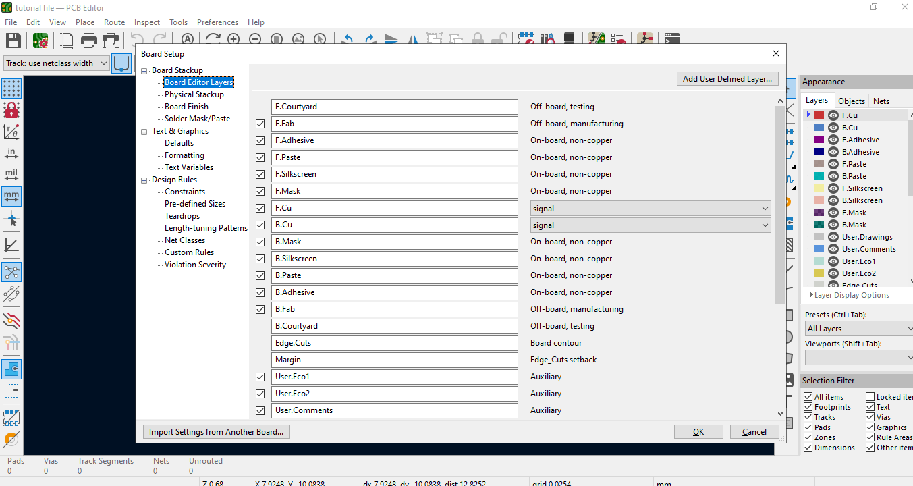

Trong phần PCB setup, bạn có thể thay đổi các lớp (layers) của mạch. Bạn có thể chọn số lớp cần thiết cho từng dự án cụ thể. Bạn có thể điều chỉnh nhiều khía cạnh và công cụ khác nhau, phần lớn là thông số kỹ thuật và một số ít là về mặt thẩm mỹ.

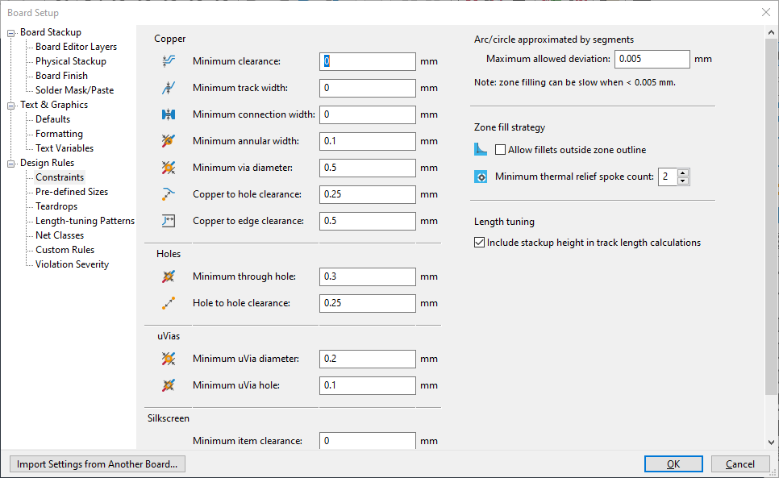

Một trong những điều quan trọng nhất cần chỉnh là Các quy tắc thiết kế (Design Rules), cụ thể là các Ràng buộc (Constraints). Những thông số này thường do nhà máy sản xuất quy định và quyết định việc mạch của bạn có sản xuất được hay không. Tốt nhất là luôn sao chép các giá trị này theo khuyến nghị của nhà sản xuất PCB __trước khi__ bắt đầu vẽ mạch. Vì đây chỉ là bài ví dụ, bạn có thể để nguyên mặc định.

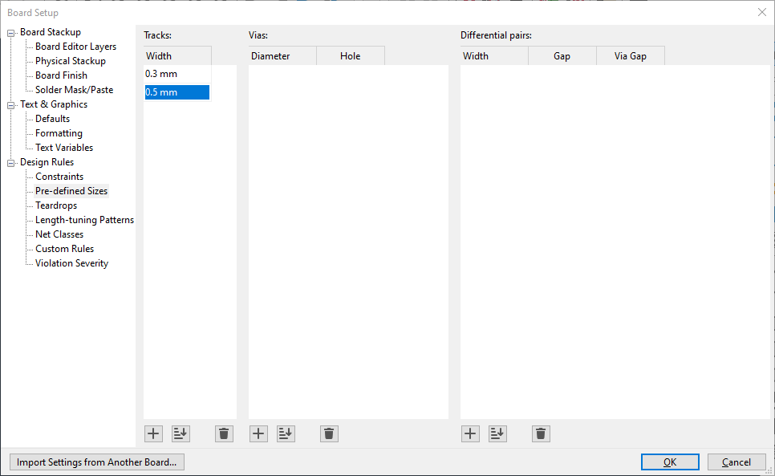

Hãy giữ nguyên hầu hết các cài đặt vì chúng không cần thiết cho dự án này. Thứ duy nhất bạn phải thêm là _Các kích thước đường mạch thiết lập sẵn (Pre-defined track sizes)_. Vào tab _"Pre-defined Sizes"_ và thêm hai kích thước 0.3mm và 0.5mm bằng dấu cộng. Tracks chính là đường dây đồng trên mạch, thao tác này cung cấp cho chúng ta hai kích thước tiêu chuẩn để làm việc: 0.3mm cho linh kiện cơ bản và 0.5mm cho các linh kiện liên quan đến nguồn. Các kích thước này không phải là chuẩn mực bắt buộc, chúng chỉ là kích thước phổ biến và linh hoạt cho các bước sau. Thêm xong, bạn nhấn OK.
 __*Khi thiết lập xong, bạn có thể nhấn F8, chọn "Update PCB" và đặt các linh kiện vào khu vực giữa màn hình.*__

### Sắp xếp Linh kiện (Arranging Footprints)
Khi mới đặt xuống, bạn sẽ thấy chúng nằm thành một đống lộn xộn. Bây giờ bạn mới thấy tại sao việc đánh số (annotation) lại quan trọng cho việc tổ chức. Bạn có thể di chuyển linh kiện bằng cách click và kéo, hoặc trỏ chuột vào nó và nhấn phím _"M"_.

>[!TIP]
Bạn có thể ẩn các lớp F.Fab và B.Fab bằng cách tìm chúng ở danh sách layer bên phải và bấm vào biểu tượng con mắt. Các lớp gia công này không mang lại nhiều thông tin lúc vẽ và ẩn chúng đi sẽ giúp không gian làm việc đỡ rối mắt.

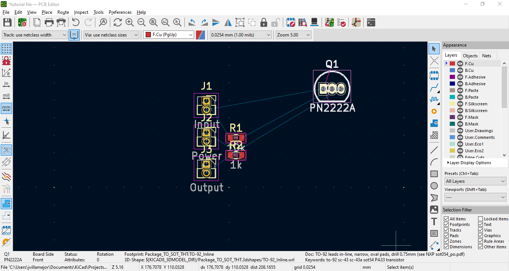

>[!TIP]
Nếu bạn có hai màn hình, hoặc thao tác chuyển tab nhanh, bạn có thể chọn một linh kiện bên Schematic Editor, nó sẽ tự động được chọn tương ứng bên PCB Editor. Điều này hỗ trợ cực kỳ đắc lực trong các dự án phức tạp.

Khi di chuyển linh kiện, bạn sẽ thấy các đường chỉ tơ (web/net) nối các linh kiện với nhau. Đường này chỉ ra chính xác linh kiện nào cần nối với linh kiện nào để hướng dẫn bạn đi dây (routing). Hãy cố gắng xếp linh kiện sao cho các đường chỉ tơ này thẳng hàng với nơi chúng cần kết nối. Cố gắng làm sao cho các đường mạch đi trực tiếp và không cắt nhau, đồng thời các linh kiện không nằm quá xa nhau. Có rất, rất nhiều quy tắc khi xếp linh kiện trên PCB; quá nhiều để liệt kê hết trong hướng dẫn này. Nhiều quy tắc bạn sẽ học được theo thời gian, nên tạm thời cứ sắp xếp theo cách bạn thấy logic vì đây chỉ là bài thực hành.

>[!TIP]
Một thói quen tốt là luôn bắt đầu xếp các linh kiện quan trọng nhất trước, rồi mới đến các linh kiện phụ.

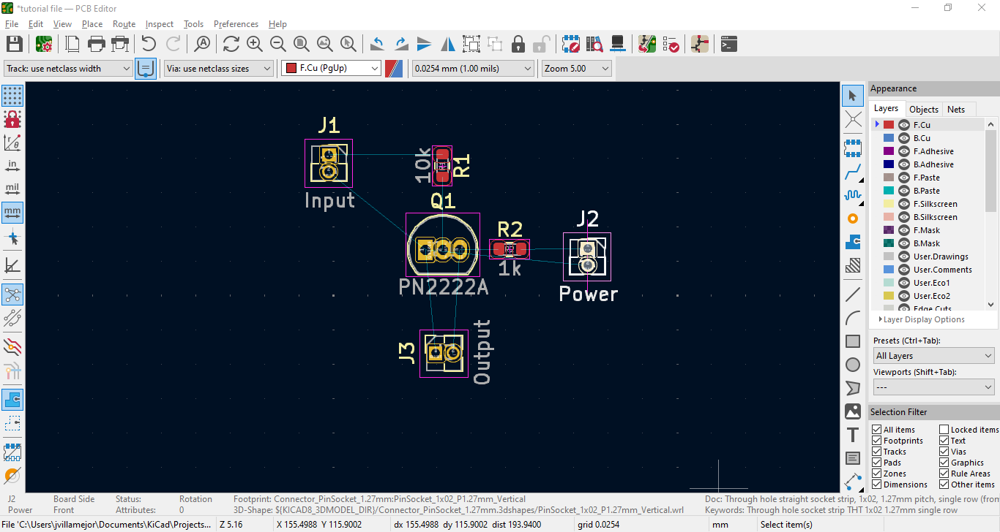

Như bạn thấy, tôi đã xếp linh kiện sao cho các đường mạch không đâm xuyên qua linh kiện nào quan trọng. Đường chỉ tơ duy nhất đâm xuyên qua linh kiện là đường mass của __J2__, nhưng điều này không sao vì chúng ta sẽ không đi dây mass thủ công trong dự án này.

    Mẹo: Bạn có thể nhấn "Alt + 3" bất cứ lúc nào để xem mô hình 3D của mạch. Như hình bên dưới, các linh kiện 3D hiển thị đúng theo vị trí bạn xếp trên bản vẽ 2D.

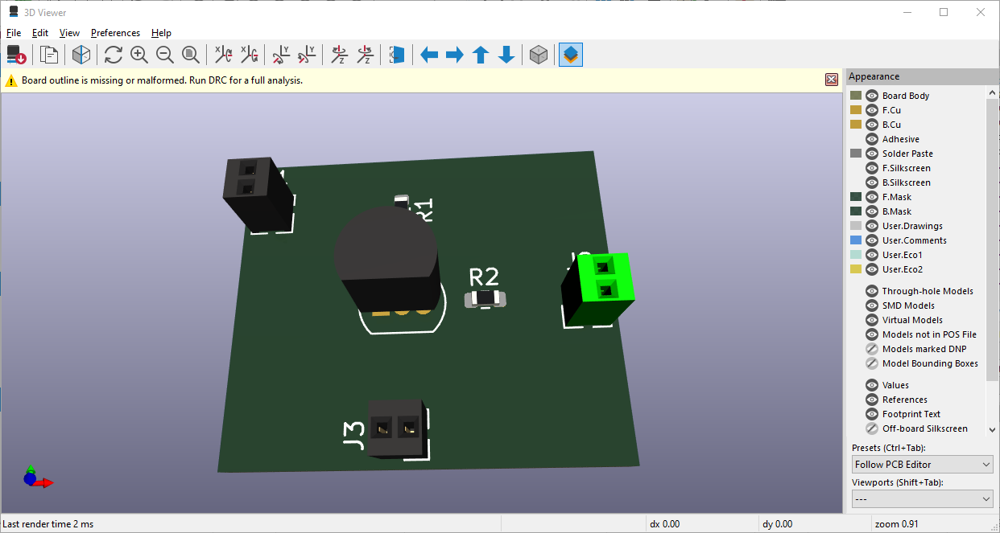

### Thêm Đường bao bo mạch (Board Outline)
Như bạn thấy trong trình xem 3D, có một lỗi báo _"Board outline is missing"_ (Thiếu đường bao mạch). Đơn giản là vì chúng ta chưa thiết lập kích thước bo mạch. Để thêm, trước tiên hãy chọn lớp _"Edge.Cuts"_ ở danh sách lớp bên phải. Lớp được chọn sẽ có mũi tên màu xanh chỉ vào.

Chúng ta sẽ vẽ các đường thẳng trên lớp này để định hình bo mạch. Việc này thiết lập kích thước để gia công. Thói quen tốt là nên dùng kích thước số chẵn. Trong dự án này, tôi thiết kế mạch 25mm x 20mm. Để mở công cụ đo lường, bạn nhấn _"Ctrl + Shift + M"_.

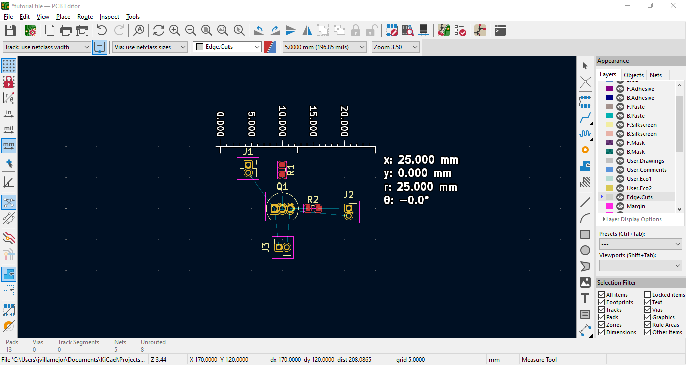

>[!TIP]
Bạn có thể nhấn phím "N" để thay đổi kích thước lưới (Grid) nhằm đạt độ chính xác cao hơn. Tôi khuyên dùng lưới 1mm khi vẽ cắt biên.

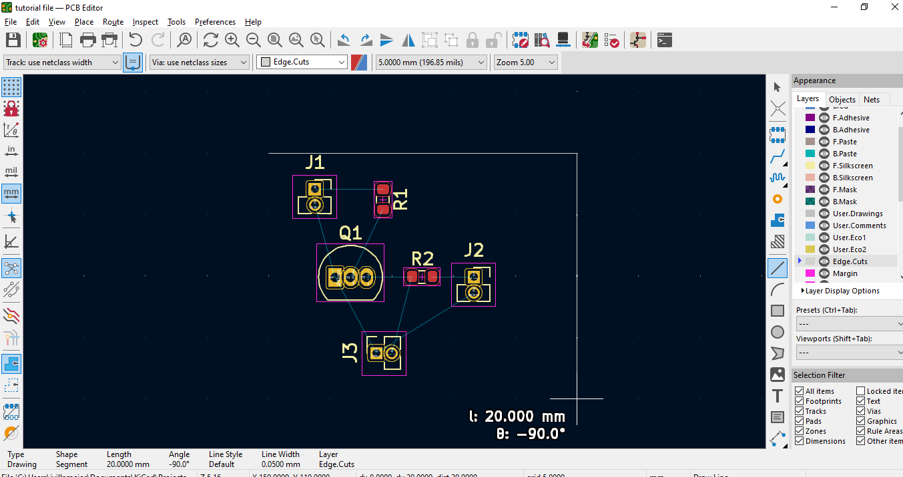

Để vẽ đường bao, chọn công cụ _"Draw a Line"_ trên thanh công cụ bên phải. Sau đó vẽ các đường viền cho PCB. Đừng ngại di chuyển linh kiện lại cho vừa vặn, chưa có gì là cố định ở bước này cả. Nếu muốn bo góc, bạn dùng công cụ Arc (vẽ cung tròn) ngay dưới công cụ Line.

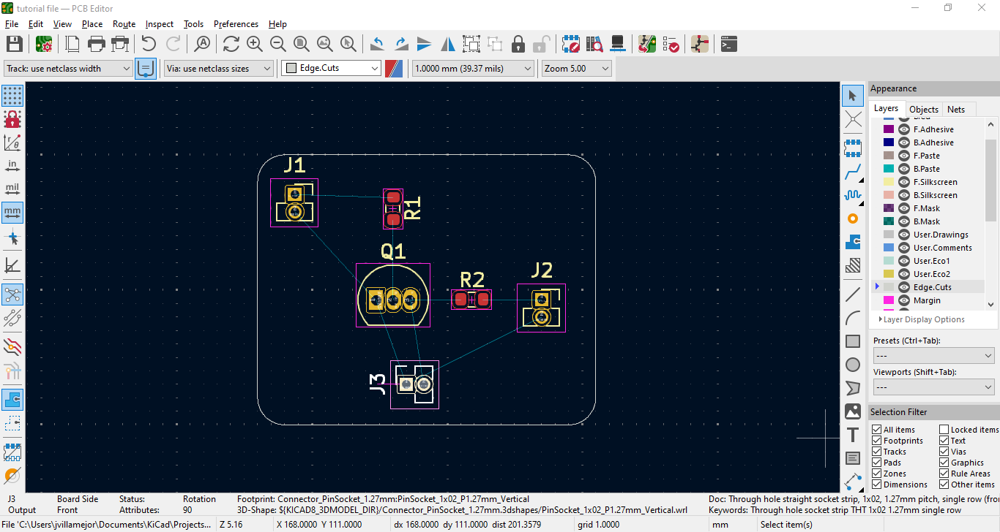

Khi hoàn thành, nó sẽ trông như thế này. Các góc bo tròn là tùy chọn, nếu bạn để góc vuông cũng hoàn toàn ổn.

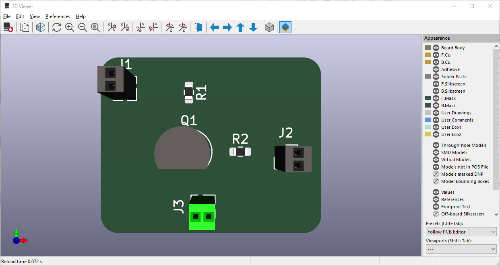

Như bạn thấy trong chế độ 3D, đường cắt mạch đã hoạt động và KiCad đã nhận dạng được hình dáng bo mạch của chúng ta.

### Đi dây các linh kiện (Routing)

Chúng ta đã có layout sơ bộ, giờ bắt đầu đi dây. Đây thường là bước tốn thời gian và đòi hỏi sự tỉ mỉ nhất. Tuy nhiên, vì mạch của chúng ta rất đơn giản nên sẽ không quá khó.

Để bắt đầu, tôi thích tạo một lớp phủ đồng mass (Copper ground plane). Việc này giúp chúng ta không phải đi dây các đường mass (GND), đồng thời làm cho việc đi dây các đường mass thông thường trở nên dễ dàng hơn.
Để làm điều này, chọn lớp đồng mặt dưới (_"B.Cu"_ trên danh sách layer), sau đó click vào nút _"Add filled Zone"_ trên thanh công cụ bên phải.

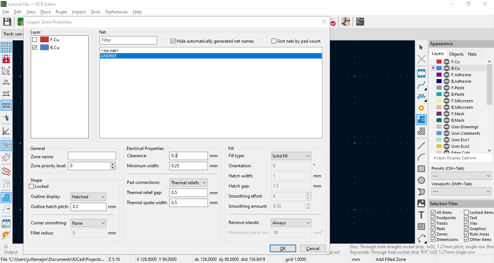

Sau khi nhấn, cửa sổ này sẽ hiện ra. Chọn mạng GNDREF vì đó là đường mạng chúng ta muốn lớp phủ đồng này liên kết. Khoảng cách an toàn (Clearances) và độ rộng (widths) cho vùng phủ đồng tùy thuộc vào từng ứng dụng, nhưng ở ứng dụng này, bạn chỉ cần đổi Clearance thành 0.3mm.

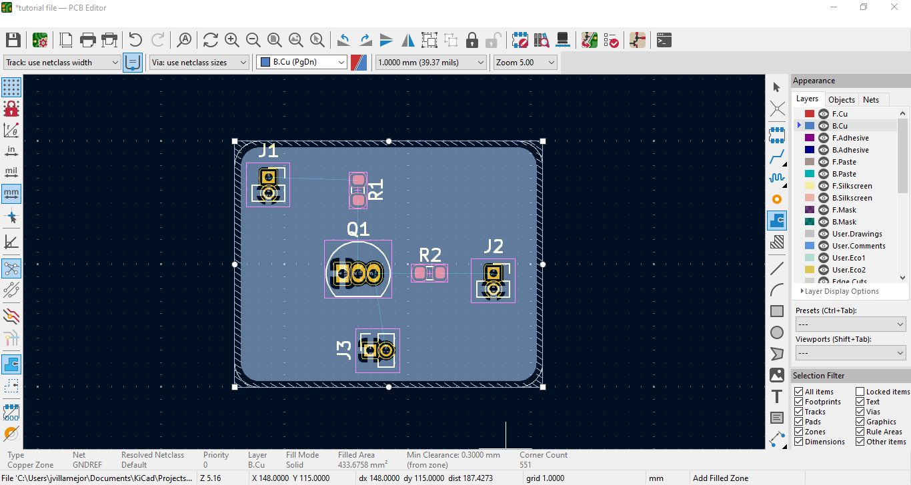

Sau khi thiết lập các thuộc tính, bạn sẽ chuyển sang chế độ vẽ. Hãy vẽ một khung bao quanh toàn bộ PCB như hình trên. Khi khép kín khung, nhấn phím _"B"_ để điền đầy vùng đồng (fill). Thao tác này tạo ra lớp phủ mặt dưới và có thể nhìn thấy trong 3D.

>[!TIP]
Bạn có thể ẩn vùng viền màu xanh lam bằng cách nhấn nút "Show only zone boundaries" (Chỉ hiện đường viền) trên thanh công cụ bên trái (nằm gần cuối). Việc này giúp mắt dễ chịu hơn rất nhiều khi đi dây.

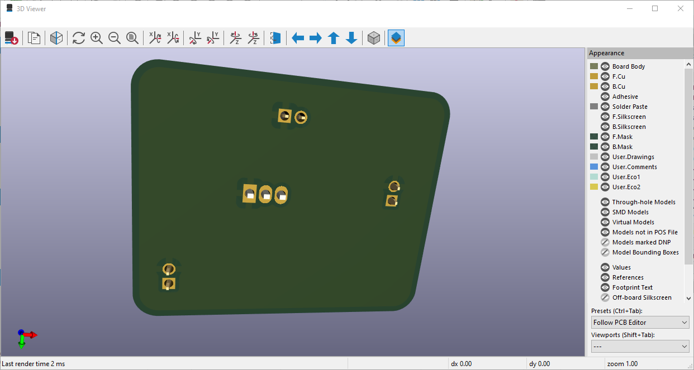

Các lỗ hình vuông thường biểu thị điểm mass trong công nghiệp, vì vậy bạn có thể thấy tất cả các mass tham chiếu của chúng ta không cần phải đi dây thủ công nữa. Điều này giúp việc đi dây mass sau này dễ hơn nhiều vì bạn chỉ cần đục một lỗ xuyên xuống bo mạch (Nhấn _"V"_ khi đang đi dây GND). Tuy nhiên, vì thiết kế này chỉ dùng mass tham chiếu (linh kiện xuyên lỗ đã tự đâm xuống lớp dưới), nên chúng ta đã hoàn tất việc đi dây mass.

Tiếp theo, ta đi dây các linh kiện thông thường. Nguyên tắc vàng là luôn bắt đầu ở những linh kiện quan trọng nhất. Để bắt đầu, nhấn nút _"Route Tracks"_ trên thanh công cụ bên phải hoặc phím _"X"_. Click vào phần chân linh kiện cần nối, kéo dây theo đường chỉ tơ để nối tới linh kiện đích. Bạn luôn có thể xóa dây bằng cách chọn chúng và bấm _Backspace_ hoặc _Delete_ hoặc hoàn tác bằng _Ctrl + Z_.
_Đừng quên, dùng đường 0.3mm cho tín hiệu thông thường!_

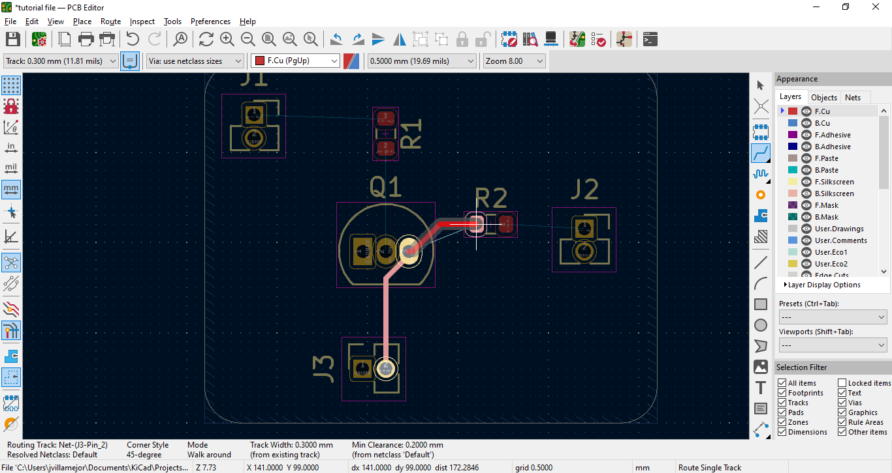

Thói quen tốt là ngay khi nhấp vào chân linh kiện, hãy bẻ cáp thoát ra xa chân một chút. Việc này tạo không gian cho các đường mạch khác, vì càng rộng rãi thì càng ít rủi ro gặp lỗi chạm chập sau này. Cứ đi theo các đường lưới (net) để biết cần nối đi đâu.
_Đừng quên, dùng đường 0.5mm cho các đường nguồn!_

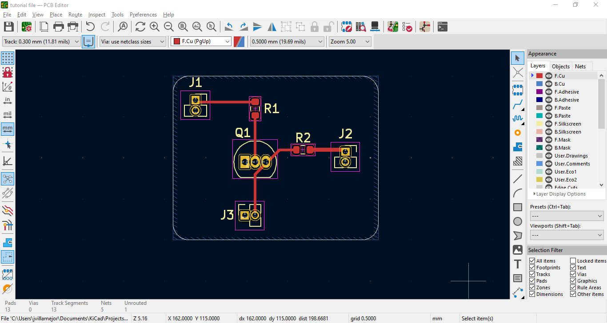

Khi đi dây xong, bo mạch của bạn sẽ trông giống thế này. Vì mạch rất đơn giản, không có đường mạch nào nằm sát nhau nên không cần dùng kỹ thuật đi dây nâng cao. Dưới đây là một mẹo đơn giản: Khi đang đi dây, bạn có thể nhấn phím _"V"_. Việc này thả một lỗ via và đổi đường mạch xuống một lớp khác để bạn có thể chui qua dưới các đường dây hiện có. Kỹ thuật này rất quan trọng cho các mạch phức tạp. Bạn cũng có thể xem đường mạch trong chế độ 3D.

>[!TIP]
Hãy di chuyển các chữ in lụa (Silkscreen) như J1, J2, Q1... ra khỏi các đường mạch. Những chữ này sẽ được in lên mạch và có thể bị mờ/khó đọc nếu đặt đè lên các đường dây.

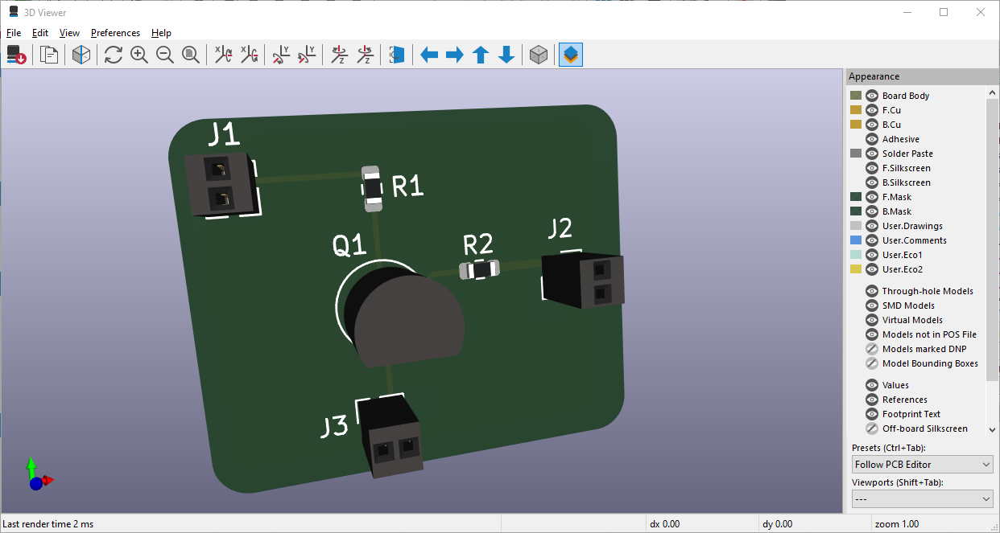

### Chạy Kiểm tra Lỗi Thiết kế (Design Rules Check - DRC)

Đi dây xong, bạn có thể chạy _"Design Rules Check"_. Công cụ này tương tự như ERC bên Schematic. Nó đảm bảo bạn không quên những lỗi quá hiển nhiên và đối chiếu thiết kế của bạn với các Ràng buộc (constraints) bạn đã thiết lập ban đầu.
 
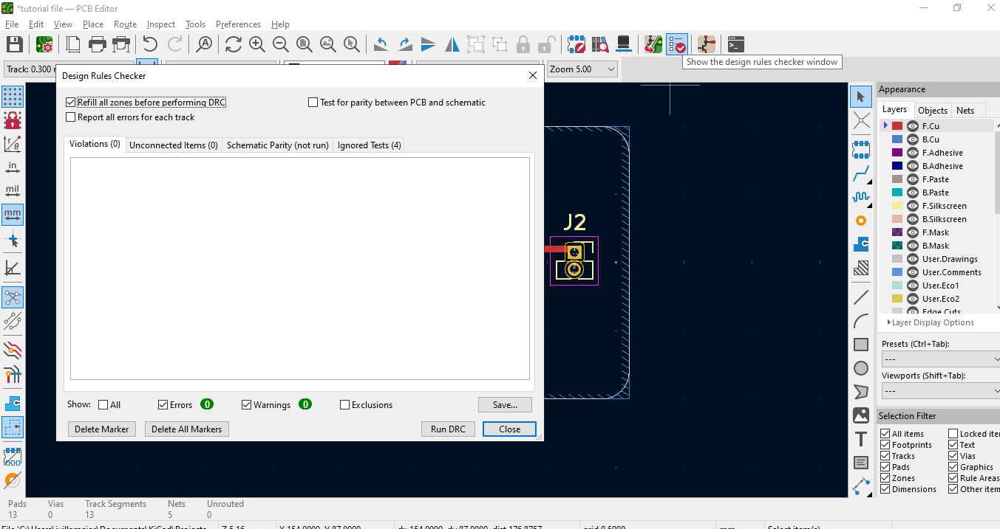

Bạn có thể tìm thấy nút này trên thanh công cụ phía trên bên phải. Vì chúng ta không cài đặt ràng buộc khắt khe nào lúc đầu, và mạch cũng đơn giản, bảng kiểm tra sẽ không báo lỗi nào.

## Xuất file Gerber và các file quan trọng khác

Khi DRC không báo lỗi hoặc không có linh kiện chưa nối dây, PCB của bạn cơ bản đã sẵn sàng để lắp ráp! Bây giờ ta phải xuất các file để gửi cho xưởng gia công PCB. Các file này thường bao gồm file Gerber, file Khoan (Drill), BOM, và Netlist. Một số xưởng yêu cầu nhiều hơn hoặc ít hơn, nhưng biết cách xuất các file này là kỹ năng quan trọng.

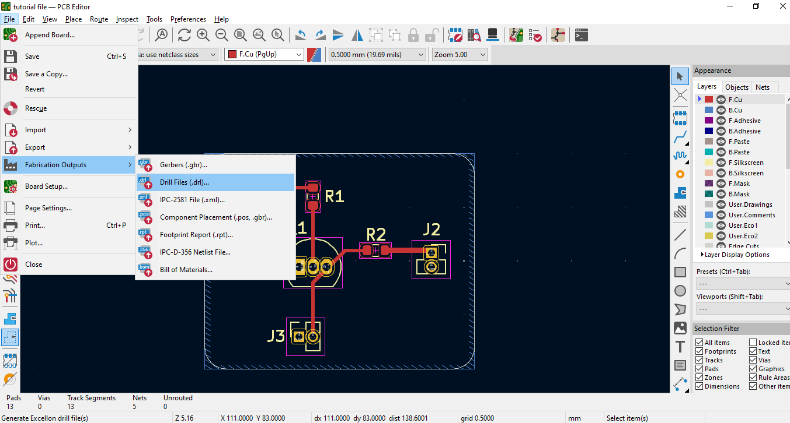

Chỉ cần vào _File -> Fabrication Outputs_ và chọn file bạn cần xuất. Drill và Gerber là hai file quan trọng nhất nên hãy bắt đầu với chúng. Tôi luôn xuất file Drill trước khi xuất file Gerber.

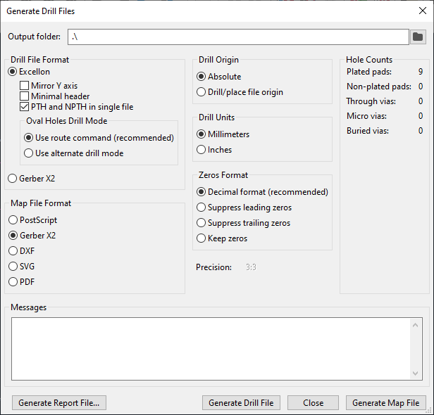

Sau khi chọn _"Drill Files"_ trong _Fabrication Outputs_, màn hình này sẽ hiện ra. Tại đây bạn có thể đi vào chi tiết cấu hình tạo file nhưng chúng ta sẽ không đi sâu trong hướng dẫn này. Bạn có thể tự tìm hiểu thêm các tùy chọn này, nhưng để đơn giản, cứ dùng cấu hình mặc định. Chọn thư mục lưu file và nhấn nút _"Generate Drill File"_.

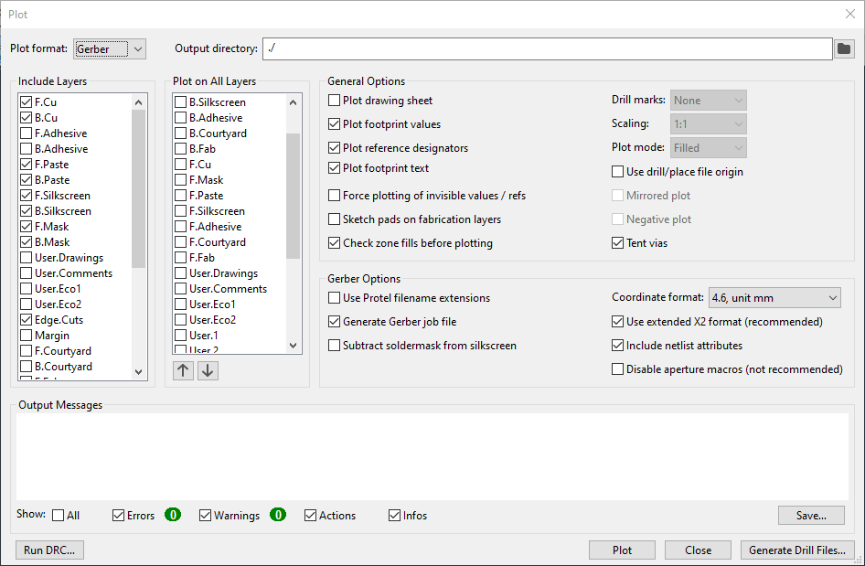

Khi file khoan đã được tạo, bạn có thể tiếp tục tạo file Gerber. Quy trình tương tự như file Drill, chỉ cần chọn _"Gerber Files"_ trong _Fabrication Outputs_. Cửa sổ này cho phép chọn các Layer (lớp) bạn muốn tạo trong file cũng như các tùy chọn khác. Một lần nữa, ta không đi sâu vào chi tiết, bạn có thể tìm tài liệu trên mạng. Để thực hành, chỉ cần chọn thư mục lưu và nhấn _"Plot"_.

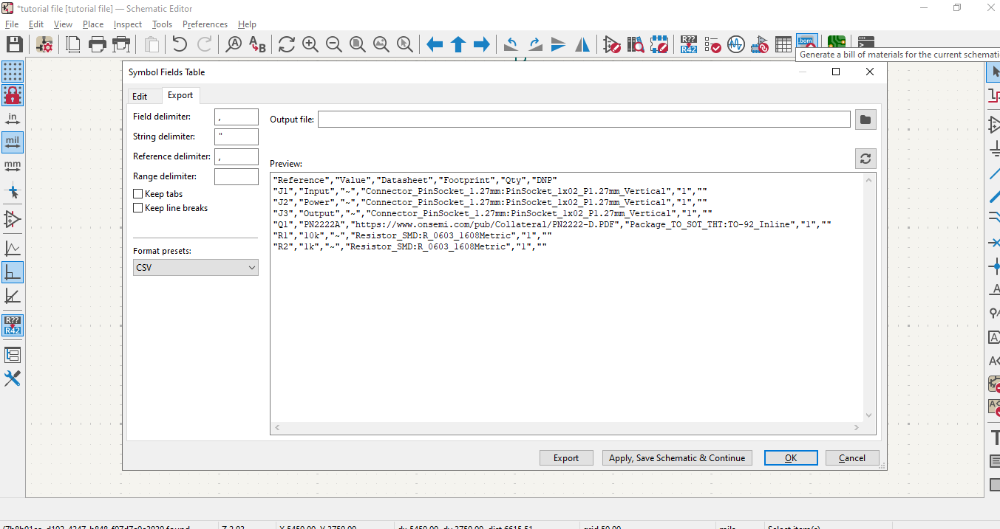

BOM (Bill of Materials - Danh sách vật tư) thì khác một chút. Bạn có thể xuất BOM từ _Fabrication Outputs_ nhưng chúng ta chưa chỉnh sửa dữ liệu cho nó. Để làm việc này, bạn phải quay lại __Schematic Editor__ và nhấn nút BOM trên thanh công cụ phía trên bên phải. Thao tác này mở trình chỉnh sửa BOM để bạn nhập thủ công các linh kiện cụ thể cần mua cho thiết bị. Khi chỉnh sửa xong, nhấn _Export_ để tải file BOM về thư mục đã chọn.

## Xem file Gerber của bạn

KiCad có sẵn một công cụ đọc Gerber tích hợp tên là __*Gerber Viewer*__.

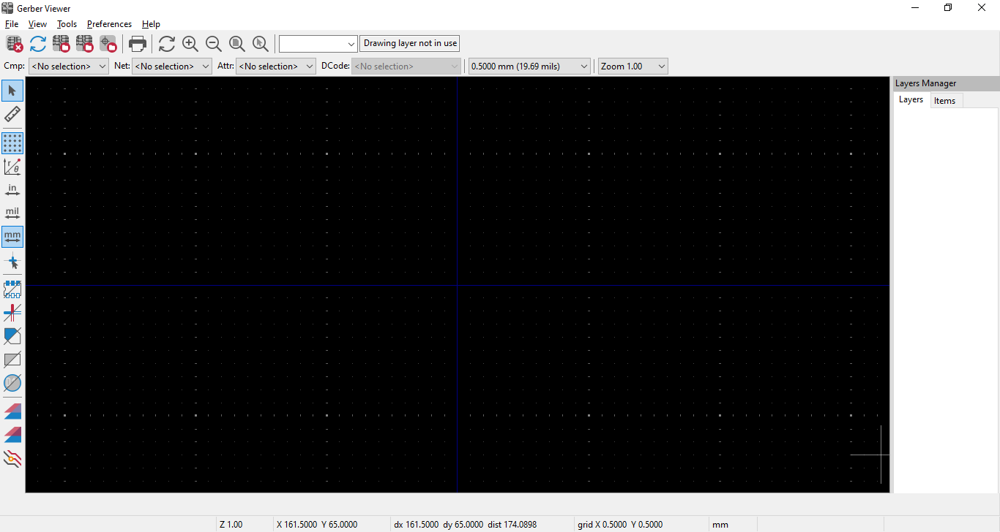

Khi mở lên, màn hình sẽ trống rỗng. Để mở file Gerber bạn vừa tạo, vào _File -> Open Gerber Plot Files_, điều hướng đến thư mục vừa xuất và chọn tất cả các file có đuôi _.gbr_.

>[!TIP]
Bạn có thể chọn nhiều file cùng lúc bằng cách click file Gerber trên cùng trong danh sách, giữ phím Shift và click file dưới cùng.

Khi load lên nó sẽ trông thế này. Đây chính xác là những gì nhà máy sản xuất sẽ nhận được để làm ra cái bo mạch của bạn. Đây là lúc bạn nên làm các khâu kiểm tra cuối cùng để phát hiện các sai sót.

Sau khi load file Gerber, tiếp tục vào _File -> Open EXCELON Drill File_ và chọn file Drill đã tạo. Bạn sẽ thấy một lớp nữa được thêm vào như hình trên (các lỗ khoan). Sau đó bạn có thể bắt đầu ẩn hiện các lớp để xem chi tiết mọi phần trong thiết kế.

Chỉ cần click vào các ô checkbox ở danh sách Layer bên phải để ẩn các lớp. Bằng cách này, bạn có thể kiểm tra kỹ từng milimet bản thiết kế. Khi đã hài lòng, bạn có thể gửi các file này cho xưởng PCB để họ sản xuất. Chúc mừng! Vậy là bạn đã nắm được toàn bộ quy trình KiCad và sản xuất PCB cơ bản.

>[!IMPORTANT]
Bài hướng dẫn vẫn chưa hết đâu! Kéo xuống để xem các mẹo bổ sung nhé!

# Các Mẹo Khác (Miscellaneous Tips)
## Thêm Thư viện Symbol và Footprint
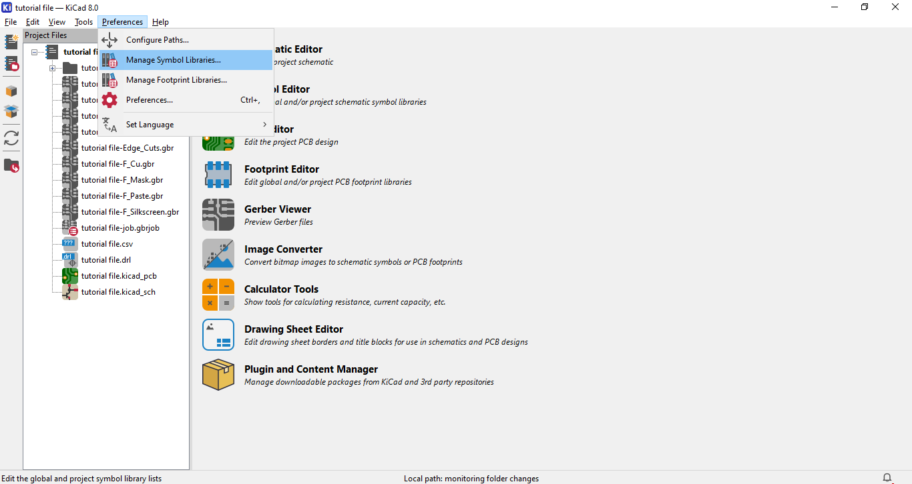

Để chỉnh sửa thư viện Symbol hoặc Footprint, vào _Preferences_ và chọn loại bạn muốn chỉnh. Quy trình làm việc của cả hai giống nhau và có thể áp dụng tương tự. Trong ví dụ này, chúng ta sẽ thử thêm một thư viện Footprint.

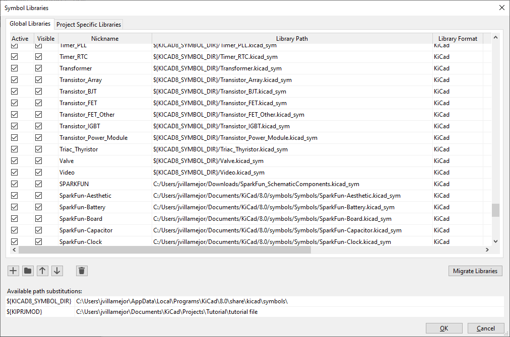

Đầu tiên bạn cần một thư viện để tải lên KiCad. Bạn có thể tìm thấy rất nhiều loại trên mạng, tùy bạn muốn thêm thư viện gì. Ở đây tôi thêm thư viện _Sparkfun-Capacitors_. Như bạn thấy, tôi đã cài đặt sẵn một số thư viện Sparkfun khác.

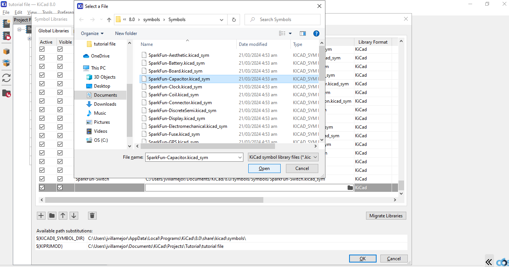

Khi đã tải file về, click vào dấu cộng, sau đó click vào biểu tượng thư mục ở hàng trống vừa tạo, tìm đến thư mục chứa file thư viện. Đặt tên (Nickname) cho nó và nhấn OK. Nếu định dạng file đúng, bạn sẽ có thể lấy Symbol mới ra dùng trong Schematic Editor.

Đừng quên làm thao tác tương tự cho thư viện Footprint, nếu không bạn sẽ không tìm thấy Footprint phù hợp cho Symbol vừa tải!

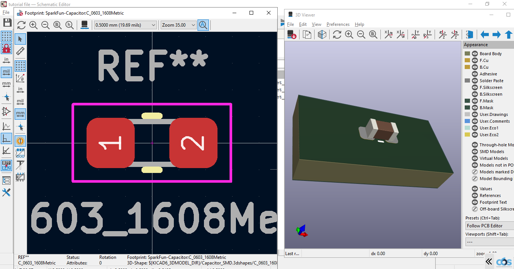

## Thêm mô hình 3D (3D Models)

Một số Footprint trong thư viện bị thiếu và không có mô hình 3D. Điều này thường không sao vì nó không bắt buộc trong quá trình lắp ráp (assembly). Bạn hoàn toàn có thể thiết kế xong PCB mà không cần xem 3D; tuy nhiên, tôi cho rằng nó giúp bạn đưa ra các quyết định chính xác về kích thước không gian linh kiện và hỗ trợ rất nhiều cho quá trình thiết kế cơ khí. Nếu bạn muốn gắn mô hình 3D vào một Footprint bị thiếu, đây là cách làm!

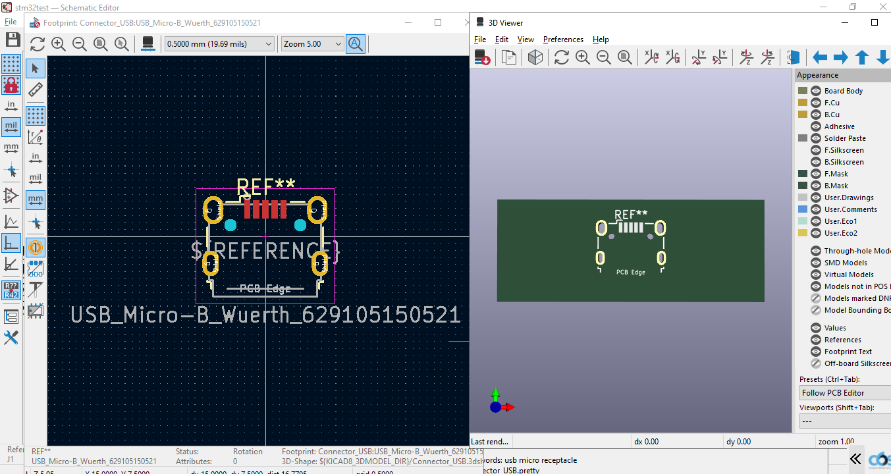
 
Như bạn thấy trong ví dụ, Footprint này hoạt động và chính xác về mặt kích thước, nhưng hình ảnh 3D bị khuyết (chỉ thấy các lỗ chân hàn). Để thêm mô hình 3D, chúng ta cần tìm nó trên mạng. Thông thường các nhà sản xuất linh kiện (Manufacturer) cung cấp sẵn các file này và khá dễ tìm.

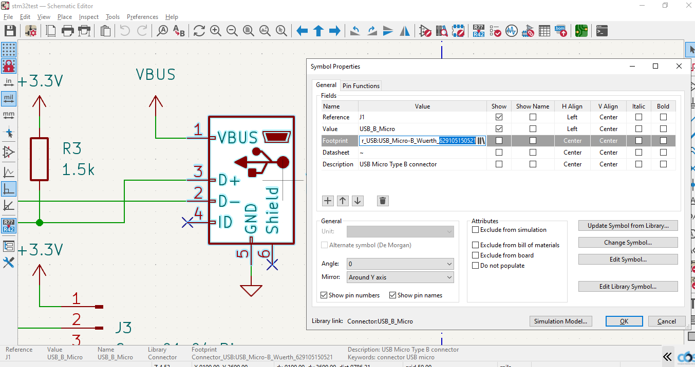

Đầu tiên, chọn linh kiện trong _Schematic Editor_, click đúp vào nó và tìm số Mã linh kiện (Part number - MPN). Trong hình trên, mã linh kiện là đoạn được bôi sáng. Thường chúng nằm ở cuối tên file Footprint. Khi tìm Google mã này, nó sẽ dẫn đến trang web của nhà sản xuất. Trang này thường có mục Download chứa chính xác file CAD chúng ta cần. Tải file định dạng STP (STEP).

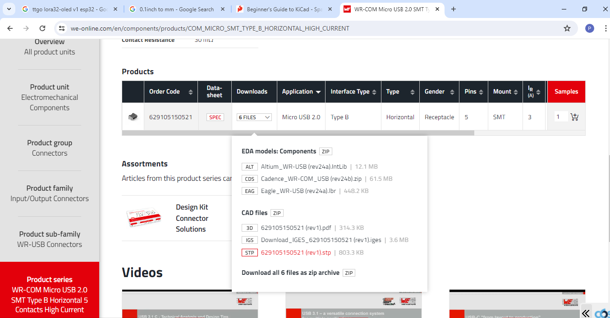

Sau khi tải về, hãy đặt nó ở nơi dễ tìm, tôi khuyên bạn nên di chuyển nó vào ngay thư mục Project.

.png>)

Khi đã có file, hãy click đúp vào footprint bên trong __PCB Editor__ và cửa sổ thiết lập sẽ hiện ra. Chuyển sang tab _3D Models_ và bạn sẽ thấy đường dẫn mô hình đang bị hỏng.

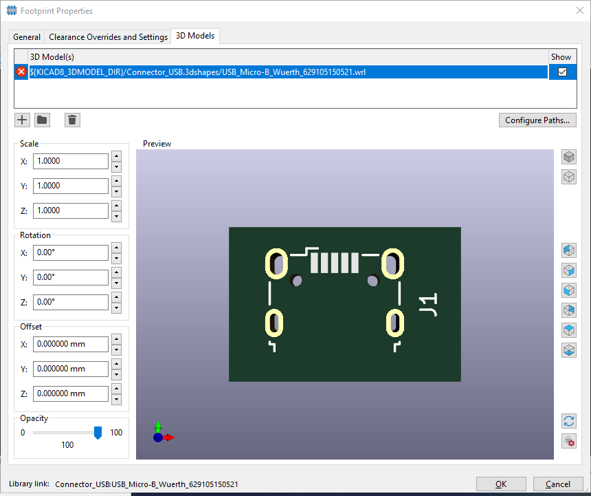

Bạn có thể xóa đường dẫn mô hình hỏng bằng biểu tượng thùng rác dưới danh sách models. Sau đó dùng biểu tượng thư mục để chọn file `.stp` bạn vừa tải. Nó sẽ xuất hiện giống như hình dưới.

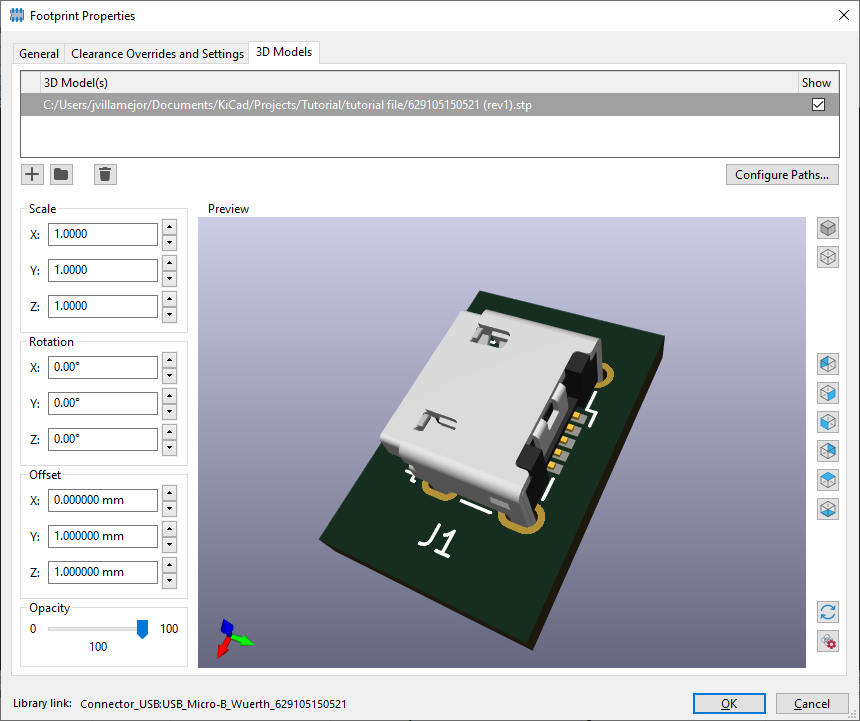

Mô hình có thể cần chỉnh tỷ lệ (Scaling) hoặc dịch chuyển (Offsetting) để khớp với chân hàn. Mô hình cụ thể này cần dịch chuyển 1mm theo trục Y và Z. Bước này có thể cần chút thời gian căn chỉnh (trial and error) nhưng khi làm đúng, nó sẽ khớp hoàn hảo.

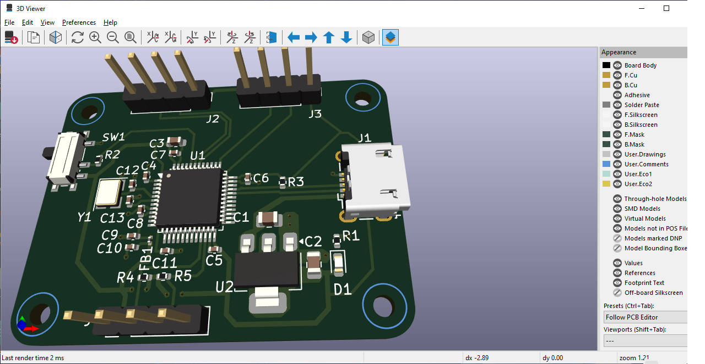

Sau khi nhấn _Ok_, Footprint của bạn đã có một mô hình 3D hoàn chỉnh và trông rất "ăn nhập" với thiết kế tổng thể!

## Tạo Footprint Tùy chỉnh (Custom Footprints)

Trong một số trường hợp (đặc biệt khi làm R&D thực tế), bạn sẽ cần sử dụng một linh kiện không có sẵn thư viện trên mạng. Để giải quyết, chúng ta có thể tự tạo Footprint và Symbol tùy chỉnh của riêng mình.

Để bắt đầu vẽ Footprint, từ màn hình chính của KiCad, chọn _"Footprint Editor"_. Khi vào, bạn sẽ thấy một bản vẽ trống. Trước tiên hãy tạo một thư viện tùy chỉnh mới để chứa Footprint của bạn. Vào _File -> New library_. Đặt tên tùy ý và chọn _Global_ để Footprint này có thể dùng lại cho mọi dự án trong tương lai. Sau đó chọn loại linh kiện bạn đang vẽ, trong ví dụ này ta vẽ loại linh kiện xuyên lỗ (through-hole).

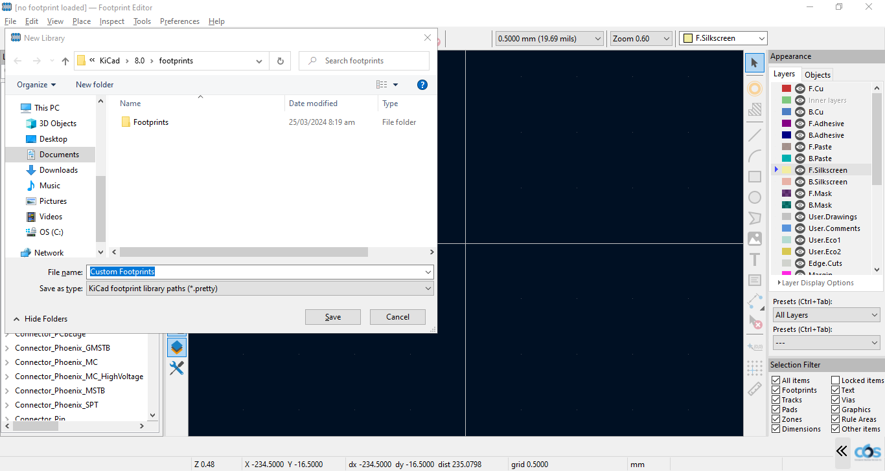

Để vẽ Footprint, bạn cần số đo chính xác khoảng cách giữa các chân (Pitch) và kích thước chân. Hình Datasheet bên dưới bị thiếu một vài dữ liệu quan trọng nhưng bạn luôn có thể dùng thước kẹp (Caliper) để đo trực tiếp trên linh kiện thực tế. Khi vẽ Footprint, độ chính xác là yếu tố sống còn.

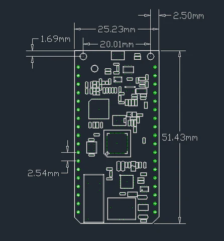

Đầu tiên, xác định khoảng cách giữa các chân của linh kiện. Trong trường hợp của tôi là 2.54mm. Để đặt các chân hàn chính xác, chúng ta phải sử dụng lưới (Grid). May mắn là có sẵn lưới mặc định 2.54mm giúp việc đặt chân dễ dàng hơn nhiều. Nếu khoảng cách chân của bạn không có trong danh sách, bạn có thể tạo lưới tùy chỉnh bằng cách bấm mũi tên xổ xuống ở ô chọn lưới và nhấn _Edit Grids_. Một cửa sổ hiện ra cho phép bạn bấm dấu cộng để tạo lưới theo ý muốn.

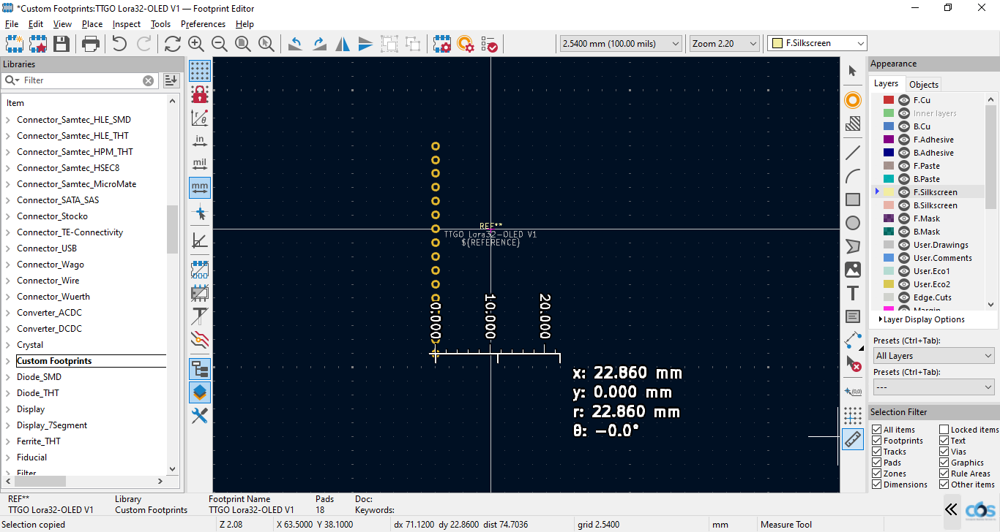

Giờ chuyển sang đặt chân (pad placement). Chọn nút _"Add a pad"_ trên thanh công cụ phía trên bên phải. Đặt các chân xuống bám theo lưới để chúng có khoảng cách chuẩn xác. Đảm bảo bạn đang làm việc trên lớp Front silkscreen! Khi đã đặt xong một hàng chân, bạn có thể copy và paste chúng sang bên kia. Đảm bảo các số đo vẫn cực kỳ chính xác!

>[!TIP]
Đừng quên sử dụng công cụ đo lường (Measurement tool - Ctrl + Shift + M)!

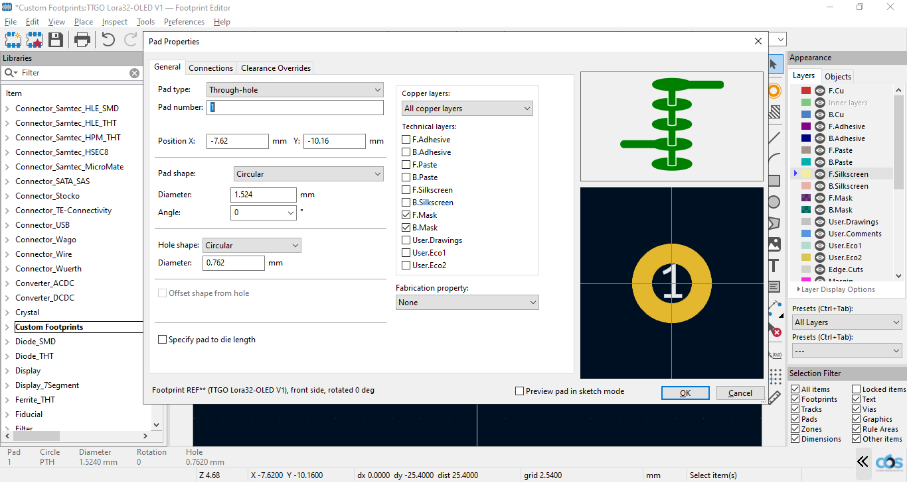

Nhưng khoan đã! Trước khi copy paste toàn bộ hàng chân, bạn hãy chọn chân bằng cách click đúp vào nó. Tại đây, bạn có thể chỉnh sửa Tên/Số thứ tự chân __(cực kỳ quan trọng)__ cũng như kích thước pad, khoảng cách an toàn (clearances) và nhiều biến số khác. Đảm bảo các thông số này khớp với linh kiện thực tế. Hãy chắc chắn rằng các chân được dãn cách chuẩn và kích thước lỗ (hole size) chính xác trước khi copy sang bên đối diện.

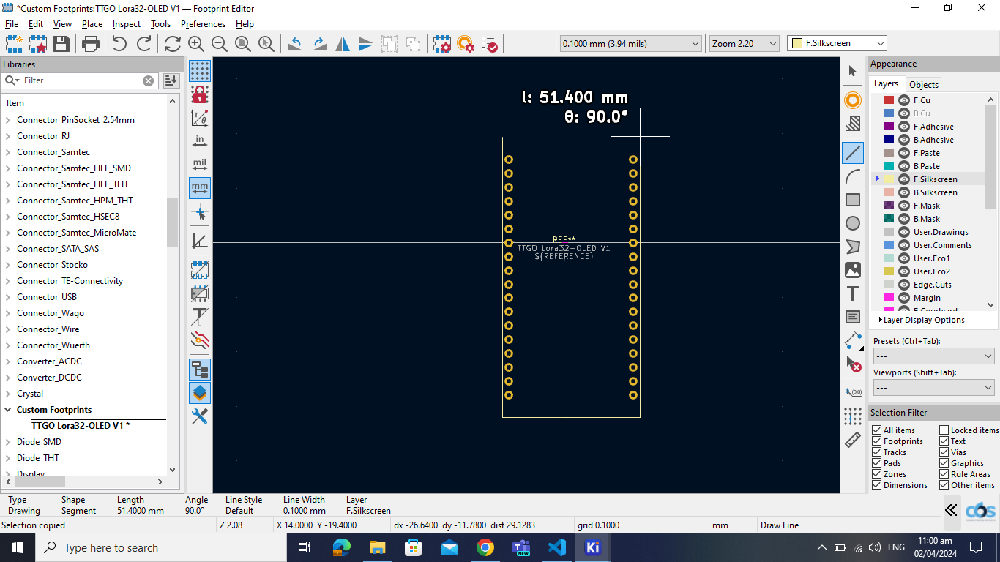

Tiếp theo chúng ta sẽ vẽ đường viền in lụa (Silkscreen outline). Lớp này giúp in một khung viền lên PCB để thợ hàn dễ lắp ráp. Thói quen tốt là nên vẽ đường này lớn hơn kích thước linh kiện thật một chút, để sau khi cắm linh kiện vào ta vẫn nhìn thấy đường viền định vị.

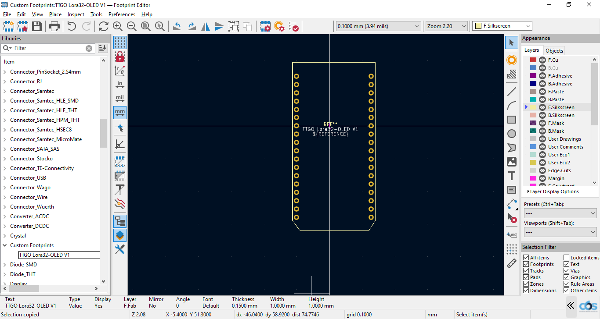

Vì bước này không mang tính bắt buộc (một số Footprint thậm chí không có đường viền lụa), bạn không cần phải vẽ chính xác tuyệt đối. Cố gắng vẽ sao cho dễ nhìn để người thợ (assemblers) hàn dễ dàng và ít mắc lỗi hơn. Xong việc này là bạn đã có một Footprint tự tạo sẵn sàng để sử dụng!

## Tạo Symbol Tùy chỉnh (Custom Symbols)

Có Footprint rồi thì giờ chúng ta chuyển sang tạo Symbol! Khác với Footprint, Symbol không yêu cầu độ chính xác về mặt kích thước vật lý. Bạn toàn quyền kiểm soát tính thẩm mỹ và hình dáng của Symbol. Khi tạo Symbol tùy chỉnh, tôi cố gắng vẽ mô phỏng lại hình dáng thực tế của linh kiện, nhưng một số người thích dùng các khối ký hiệu điện tử. Để bắt đầu tạo Symbol, mở trình khởi chạy chính của KiCad và nhấn _"Symbol Editor"_. Tương tự như Footprint, chúng ta phải tạo một thư viện mới để lưu nó.

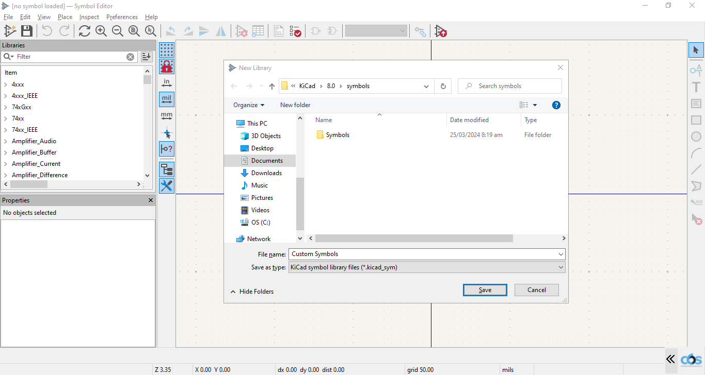

Khi đã có thư viện mới, nhấn nút _"Create new symbol"_ trên thanh công cụ phía trên hoặc dưới tab _Files_.

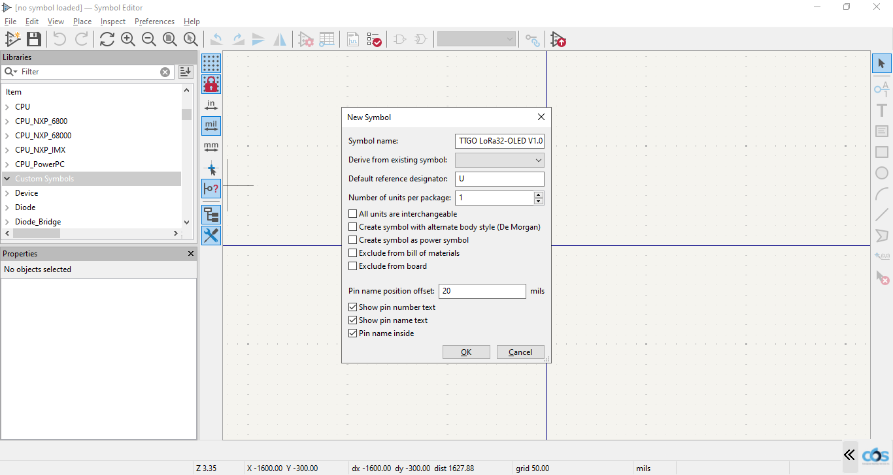

Tại đây bạn có thể thay đổi các chi tiết về Symbol. Những tùy chọn này không quá quan trọng; bạn chỉ cần nhập tên và chọn một ký hiệu tham chiếu (Reference symbol - ví dụ U cho IC, R cho trở, J cho giắc cắm) và để phần còn lại ở chế độ mặc định.

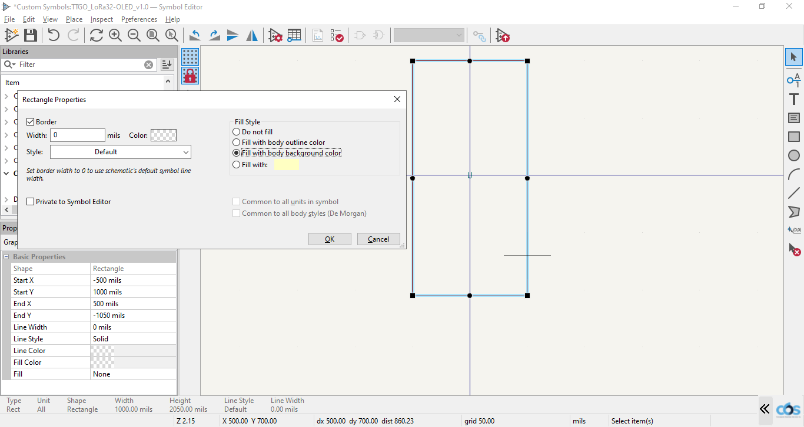

Vì linh kiện tôi đang tạo là một vi điều khiển (microcontroller) hình chữ nhật, tôi dùng công cụ hình chữ nhật (rectangle tool) trên thanh công cụ bên phải để vẽ. Như đã nói, bước này không cần chính xác nên bạn vẽ hình gì cũng được. KiCad có công cụ vẽ đường thẳng và cung tròn tự do để bạn tạo hình thù mình muốn. Khi có một hình khép kín, click đúp vào nó để mở menu thuộc tính. Tick chọn _"Fill with body background color"_. Việc này sẽ tô màu nền vàng mặc định của KiCad, báo hiệu đây là phần thân chính của Symbol.

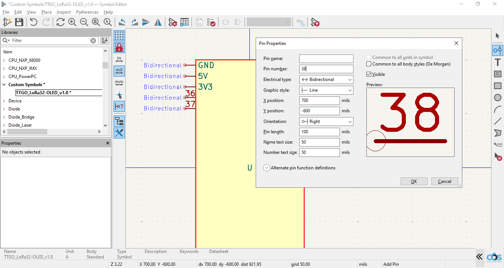

Sau khi thân đã được tô màu, bạn có thể bắt đầu đặt các chân (pins) cho linh kiện. Công cụ _"Add pins"_ nằm trên thanh công cụ bên phải (phía trên). Khi chọn công cụ này và click vào màn hình, cửa sổ thuộc tính chân sẽ hiện ra. Với cửa sổ này, bạn có thể tinh chỉnh thông tin chân. __Đây là bước quan trọng nhất khi tạo KiCad Symbol.__ Bạn phải đảm bảo loại điện học của chân (Input, Output, Power...) là chính xác và số thứ tự/tên chân phải đúng. Bạn thường có thể tìm thấy sơ đồ cấu hình chân (pinout) trên mạng và dùng chúng làm tài liệu tham khảo cho bước này.

>[!TIP]
Bạn có thể chỉnh sửa Symbol bất cứ lúc nào trong quá trình làm dự án, nên đừng sợ làm sai ở bước này, bạn luôn có thể sửa lại sau.

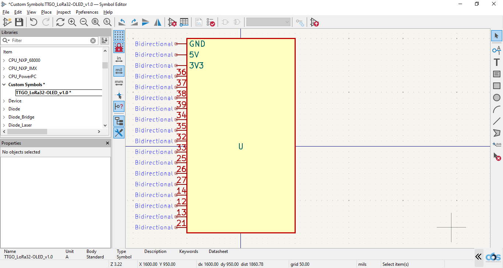

Tôi gắn toàn bộ chân ở một bên trước khi chuyển sang bên kia. Một số chân có tên chức năng rõ ràng, số khác chỉ là con số.

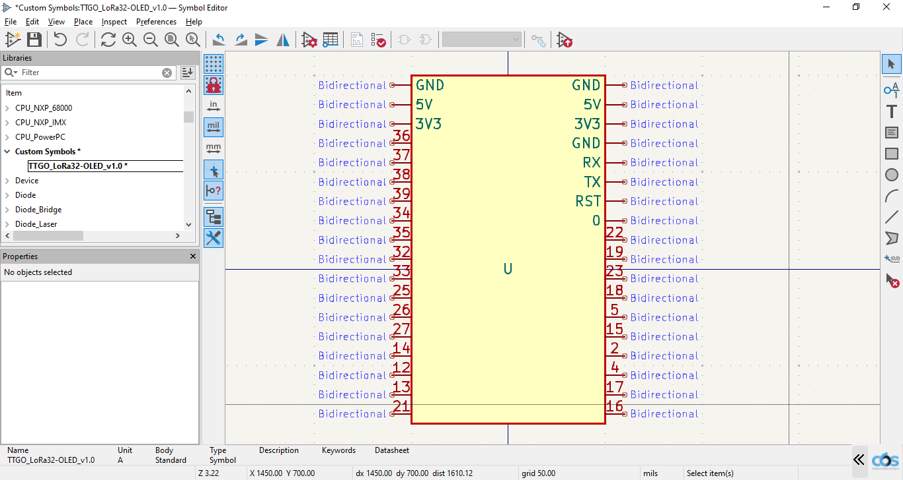

Khi cả hai bên đã được gắn đủ chân và đầy đủ các bộ phận cần thiết, bạn cơ bản đã hoàn thành! Symbol này đã sẵn sàng để dùng trong sơ đồ nguyên lý, nhưng nó chưa được gán Footprint. Để gán, hãy vào nút _"Edit symbol properties"_ (Biểu tượng bánh răng) trên thanh công cụ. Từ đó, bạn có thể tìm đến ô Assigned Footprint và duyệt qua thư viện Footprint của bạn. Khi tìm thấy thư viện, hãy chọn đúng Footprint bạn vừa tự tạo để gán cho Symbol này.

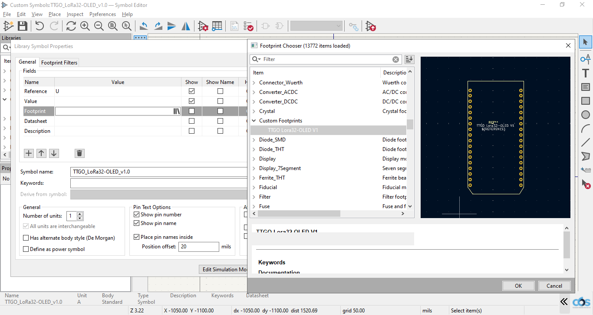

Nhấn "Ok" và Symbol của bạn đã có một Footprint mặc định đi kèm!

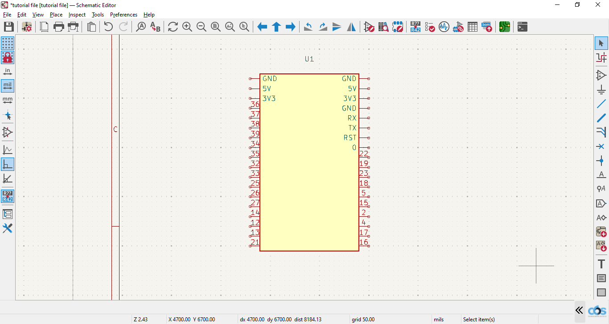

Vậy là Symbol của bạn đã hoàn thiện và sẵn sàng để tung hoành trong Schematic!

## Tài nguyên và tìm hiểu thêm

Chúc mừng! Bạn đã hoàn thành toàn bộ bài hướng dẫn cơ bản! Bây giờ bạn đã nắm vững kiến thức nền tảng của KiCad và có thể bắt đầu hành trình xoay vòng tròn với Nextwaves.

Bài hướng dẫn này được dựa trên một phiên bản tài liệu cũ của [SparkFun.](https://learn.sparkfun.com/tutorials/beginners-guide-to-kicad/all) Bản gốc đó được viết trên phiên bản KiCad cũ và cần được cập nhật, đó là lý do bản hướng dẫn (KiCad 8.0) này ra đời. Mặc dù đã cũ, nhưng tài liệu gốc đó vẫn chứa một lượng lớn thông tin về KiCad và rất nhiều mẹo hay. Họ cũng có một nguồn tài nguyên khổng lồ trên website để bạn có thể tự học thêm.